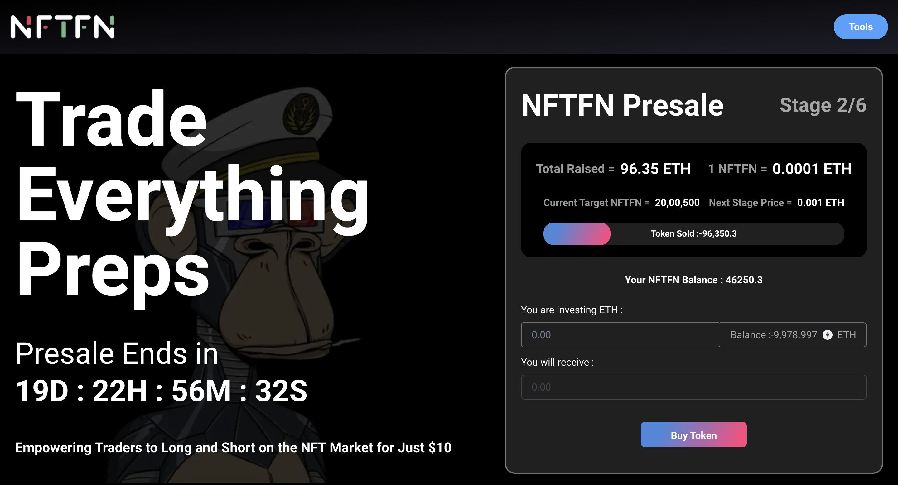
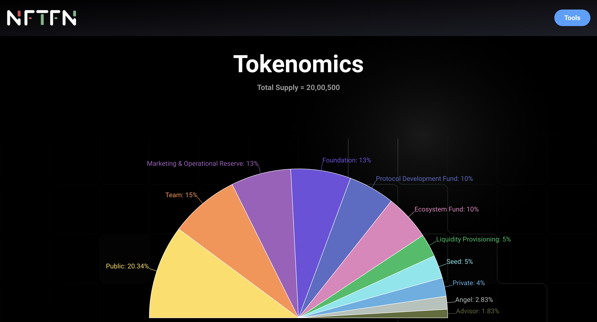
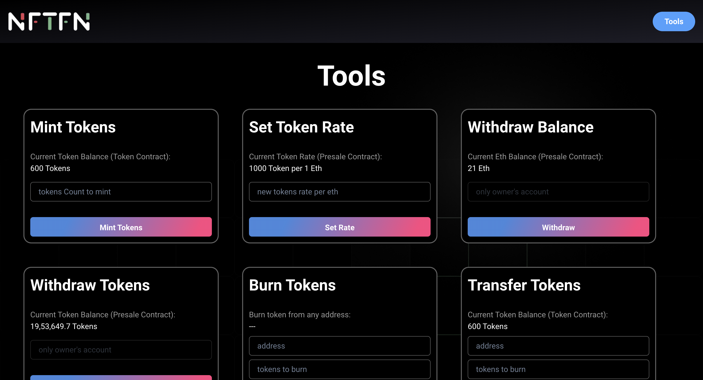
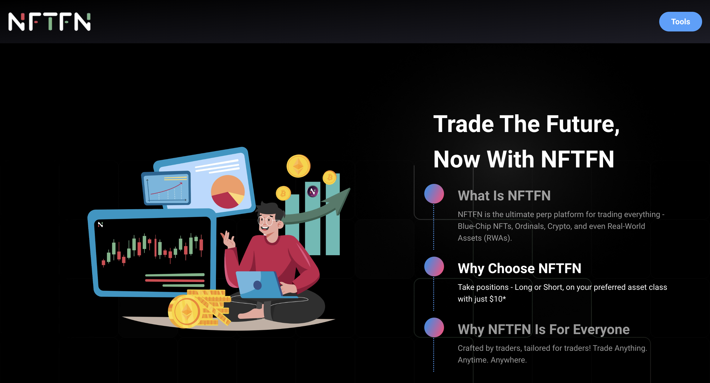

# Token Presale

Welcome to the Token Presale repository! This project focuses on developing an ERC20 token with additional minting and burning functionalities, alongside a robust Presale contract for managing token presale activities.

## Project Overview

- **ERC20 Token Features:** Enhanced token contract allowing for minting and burning of tokens.
- **Presale Contract:** Facilitates smooth management of presale processes including starting presales, withdrawing contract balances, and managing token distribution.
- **Frontend Technologies:** Built with Next.js, React.js, TypeScript, and integrated React Charts for data visualization.
- **User Experience:** Users can connect MetaMask to participate in presales, view token statistics, and learn about token benefits and investor details.

## Project URL

Visit the live project: [Token Presale](https://token-presale3-0.vercel.app/)
Project Video: [Youtube](https://youtu.be/e0EPyMWoW5Q)

## Key Features

- **User-Friendly Interface:** Connect MetaMask to buy presale tokens and track stats.
- **Token Highlights:** Showcase benefits, achievements, investors, and tokenomics.
- **Owner's Tools:** Manage presales, withdraw balances, and oversee token contracts efficiently.

## Tech Stack

- **Frontend:** Next.js, React.js, TypeScript, React Charts, Ether.js.
- **Smart Contracts:** Solidity.
- **Testing:** Chai/Mocha.
- **Development & Deployment:** Hardhat for smart contracts, Alchemy for deployment, Vercel for frontend hosting.
